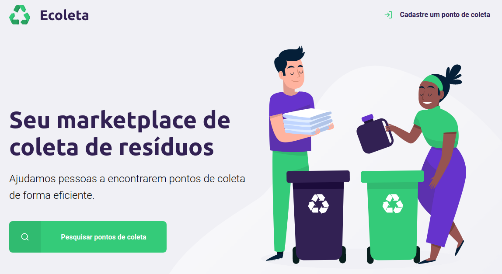

# Ecoleta
Ecoleta is a garbage collection service developed during the rocketseat Next Level Week.

<div align=center>
  
  <p>Available in https://ecoletaapp.netlify.app</p>
</div>

## :information_source: How To Use

To clone and run this application, you'll need [Git](https://git-scm.com). From your command line:

```bash
# Clone this repository
$ git clone https://github.com/daniel21h/ecoleta-service-vanillajs.git

# Go into the repository
$ cd ecoleta-service-vanillajs

# Install extensions in VSCode
  Live Server

# Run the server in index.html
  Open with Live Server
```

---

Made by Daniel Hessel :wave: [Get in touch!](https://www.linkedin.com/in/daniel-hessel-240731176/)
